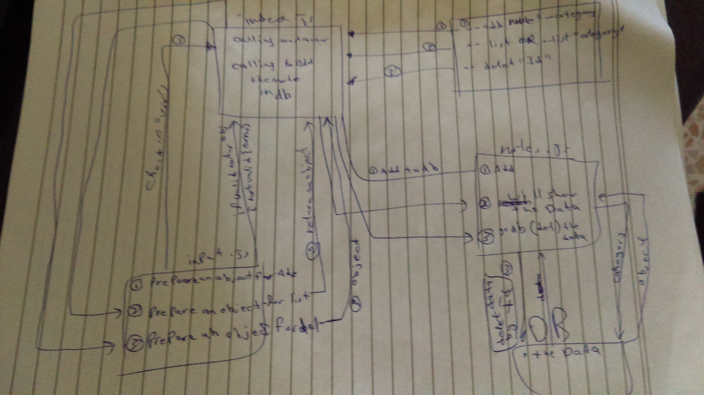

# lab-01

## Notes

### Author: Yousef AlShun

### Links and Resources

- [class03 PR](https://github.com/yousef-401-advanced-javascript/notes/pull/4)

### Modules
#### mongoose
#### `notes.js`
#### `input.js`

##### EXported Values and Methods

##### `constructors`
input return objects 
notes return the note value

### Setup

#### How to initialize/run your application

node index.js --add "write the note here" --category "note"
return adding note: "your note"
OR
node index.js --a "write the note here" --category "note"
return adding note: "your note"

OR
node index.js --list "the category"
return (the notes with that category)

OR
node index.js --delete "id"
will delete the note with that id

#### UML

